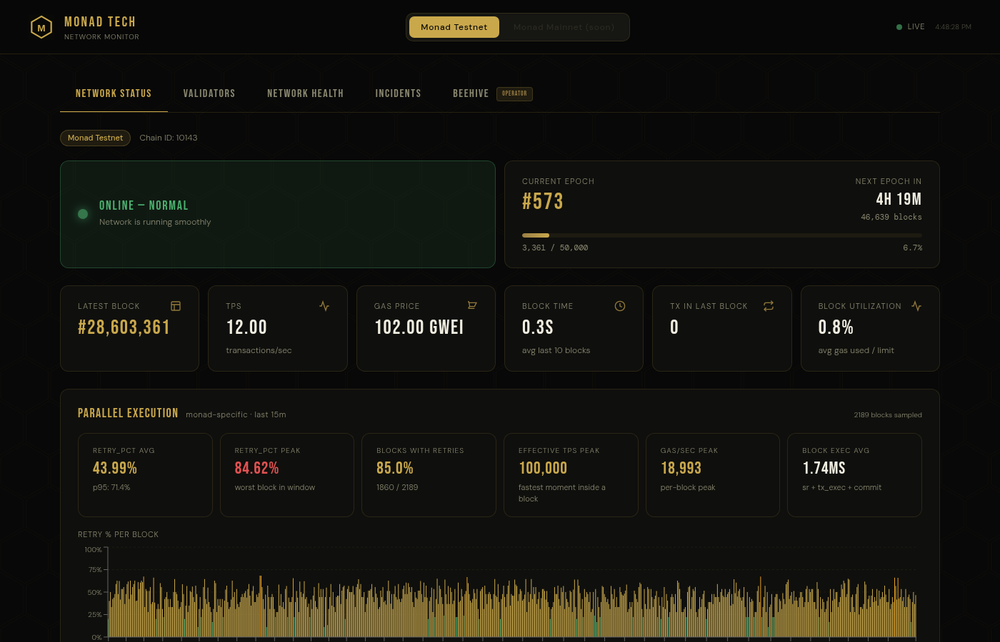
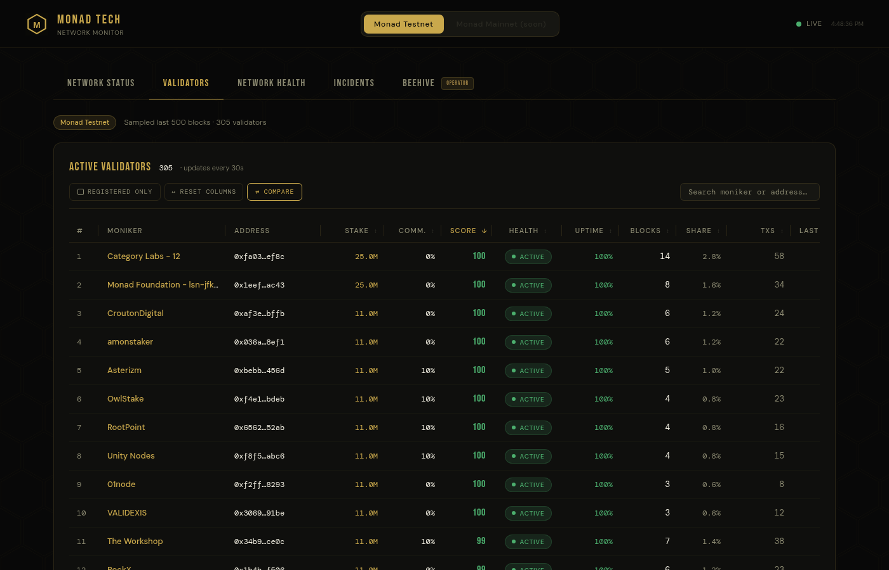
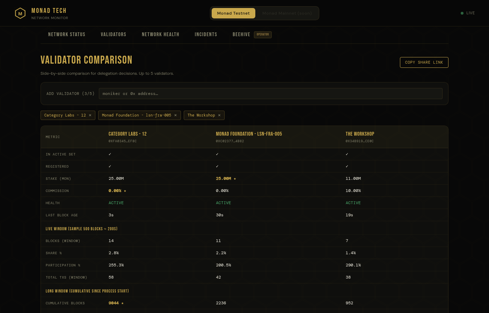
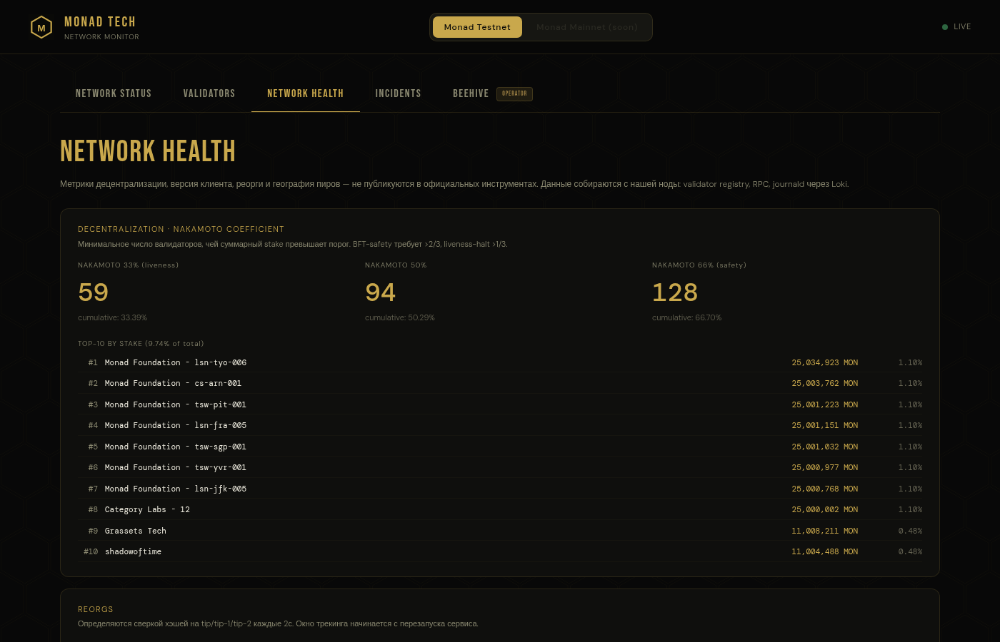
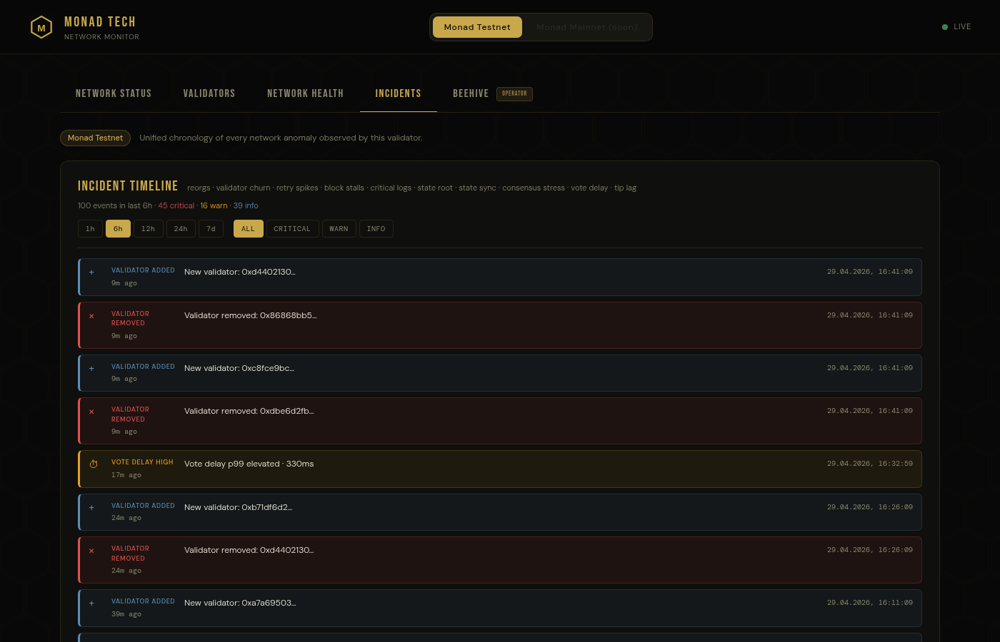
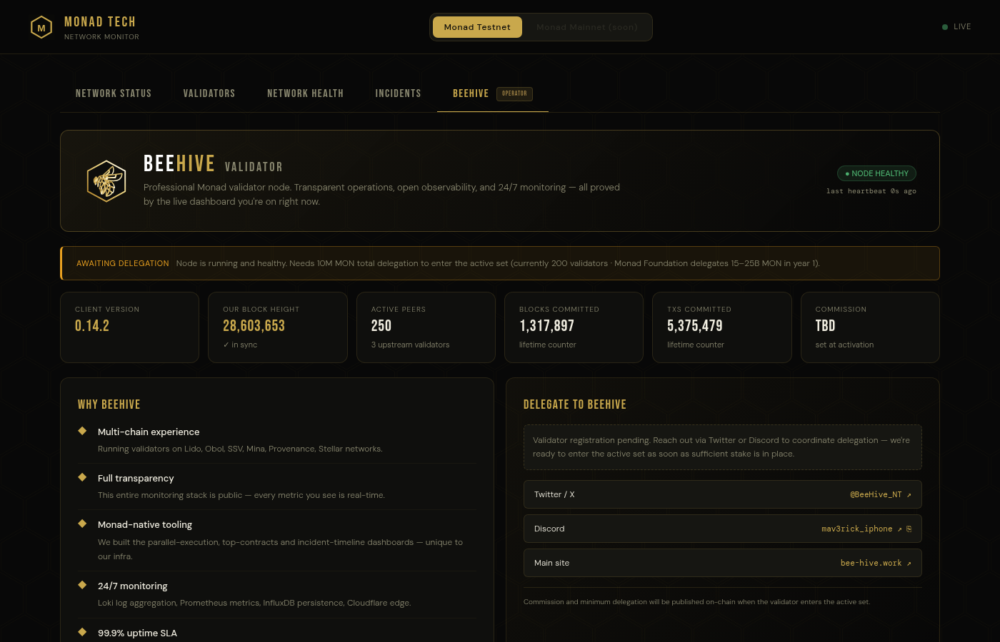

# monad-tech

Real-time **Monad observability dashboard** — testnet is fully live, mainnet runs in preview against public RPCs. Focus on the things other explorers don't show: parallel-execution metrics, a unified incident timeline, validator health scoring, network-wide decentralization insights, and a curated public-RPC catalog with live latency monitor.

🌐 Live: <https://monad-tech.com> · (legacy alias <https://monad-tech.bee-hive.work>)

[](LICENSE)


---

## Screenshots

### Network Status — home page with live KPIs and parallel-execution panel


### Validators — sortable table, health scoring, side-by-side comparison


### Validator Comparison — pick 2-5 to compare side-by-side


### Network Health — Nakamoto coefficient, top-10 stake, peer geography


### Incident Timeline — 13 event types including 6 Monad-specific anomaly detectors


### BeeHive — operator landing with live infra telemetry


---

## Why this exists

Block explorers like MonadScan cover the basics (blocks, txs, gas). This dashboard adds the things operators and delegators actually need to see:

- **`retry_pct`** — share of transactions re-executed per block due to parallel-execution conflicts. Unique to Monad's OCC engine. Surfaces which contracts break parallelism.
- **Block execution time breakdown** — `state_reset` / `tx_exec` / `commit` phases in microseconds.
- **Top contracts by retry rate** — parallelism hotspots ranked.
- **Unified incident timeline** — reorgs · validator churn · retry spikes · block stalls · critical logs · 6 Monad-specific anomaly detectors, all in one chronological feed with persistence across restarts. Reorgs are enriched with replacement miner / tx count / detection lag, and merged with a 7-day InfluxDB history so the panel never blanks out after a deploy.
- **Validator health score** — composite of block-production, uptime, recency, with penalty for unregistered signers. Block attribution uses on-chain `ValidatorRewarded` events so operators with non-authAddress beneficiaries are still credited.
- **On-chain delegator lists** — pulled directly from the staking precompile (`getDelegators(uint64,address)`, selector `0xa0843a26`) instead of block-scanning. Survives validator-set reshuffles and is correct on day one.
- **Network decentralization** — Nakamoto 33/50/66 coefficients, peer geo distribution, client version tracking.
- **Public-RPC catalog with live latency** — `/tools/rpcs` pings 19 public Monad endpoints (testnet + mainnet) every 60 s, sorts by median latency, exposes "Add to MetaMask" per network.

The goal: be the single dashboard where an operator can diagnose "is my node lagging, or is the whole network halted?" and where a delegator can compare validators on dimensions that matter.

---

## Features (quick tour)

### Network Status — the home page
- Live KPIs: latest block, TPS, gas, block time, utilization
- Epoch progress
- **Parallel execution panel**: retry_pct avg/peak, effective TPS peak, stacked execution-time breakdown
- **Top contracts by retry rate** table
- TPS / Gas / Util chart with "pixelated" squared bars
- Latest blocks + transactions with pagination + search

### Validators
- 309-row sortable table (197 in active set, 112 registered-but-not-producing or unregistered miners)
- Filter: `REGISTERED ONLY` toggle (hides block producers without a matched on-chain authAddress)
- Score = 40% health + 40% uptime + 20% recency, with 0.7× penalty for unregistered
- Columns: moniker · address · stake · commission · score · health · uptime · blocks · share · txs · last-block
- **Stake-weighted participation**: short-window (`participationPct`, 500-block sample) and long-window (`participationLong`, cumulative WS aggregator). Long-window is statistically stable after ~30 min of process runtime.

### Network Health
- Nakamoto coefficient breakdown
- Recent reorgs (usually zero — MonadBFT gives deterministic finality)
- Peer geo distribution (by country + ASN)
- Validator set changes log

### Incidents
- Unified feed of **13 event types**:
  - **Standard**: reorg · validator_added/removed/stake_decrease · retry_spike · block_stall · critical_log
  - **Anomaly detectors** (Monad-specific, edge-triggered): state_root_mismatch · state_sync_active · consensus_stress · vote_delay_high · tip_lag · exec_lag
- Reorg cards now show replacement miner (with moniker), tx count, and detection lag, and merge in-memory ring with the last 7 days from InfluxDB
- Filter by severity (all / critical / warn / info)
- Filter by range (1h / 6h / 12h / 24h / 7d)
- Persistent: survives PM2 restarts (InfluxDB-backed)

### Tools — public RPC catalog
- `/tools/rpcs` — 11 mainnet + 8 testnet public endpoints from Foundation, Alchemy, Ankr, dRPC, OnFinality, Tenderly, thirdweb, bloXroute, Tatum, MonadInfra, Natsai
- Live status: online dot, median latency over the last 5 samples, current tip block, WS support badge
- Per-network "Add to MetaMask" button using `wallet_addEthereumChain`
- Network switcher filters the catalog so the testnet tab only shows testnet RPCs and vice-versa

### BeeHive
- Operator landing page with live infra telemetry
- Client version + sync status + peer count
- Commission / minimum-delegation details
- Delegate CTA (Twitter · Discord · website)

---

## Architecture

The hot path is **push-based, not polling.** A persistent WebSocket subscription to
`monad-rpc`'s `eth_subscribe(newHeads)` fills a 1000-block ring buffer in RAM.
Every "live tip" endpoint reads from this ring at request time — zero RPC calls
per user request. (Migration story: see `feat(rpc): migrate from polling to
WebSocket push`. Eliminated 30,000+ WARN/30min on monad-rpc's triedb_env channel.)

```
   Monad validator
   ───────────────
   monad-execution  ──── shared-memory event ring (642 MB, hugepages)
                                     │
   monad-rpc :8081 ──── eth_subscribe(newHeads) bridge
                                     │ ws://, push every ~0.4s
                                     ▼
   ┌──────────────────────────────────────────────────────────┐
   │  monad-stats (this dashboard)                            │
   │                                                          │
   │  lib/wsBlockStream.ts                                    │
   │  ├─ Map<blockNum, RingBlock> ≤1000 (RAM)                │
   │  ├─ Map<miner, MinerAggregate>  (cumulative since boot)  │
   │  └─ enrichBlock: 1 eth_getBlockByNumber per push (smooth)│
   │                                                          │
   │  Hot endpoints (all 0 RPC at request time):              │
   │  ├─ /api/blocks         ← ring                           │
   │  ├─ /api/transactions   ← ring (full tx data)            │
   │  ├─ /api/stats          ← ring tip + 1 eth_gasPrice      │
   │  └─ /api/top-contracts  ← ring (5m), RPC fallback (15m+) │
   │                                                          │
   │  Background pollers (smooth-paced single calls):         │
   │  ├─ reorg detector (4s, depth-15)                        │
   │  ├─ TPS per-second collector (1s)                        │
   │  ├─ validator-set tracker (60s)                          │
   │  ├─ exec-stats writer → InfluxDB (30s, parses Loki logs) │
   │  ├─ anomaly detectors (30s, Prometheus + 2 RPC)          │
   │  └─ peer-geo refresh (30min)                             │
   └──────────────────────────────────────────────────────────┘
                  │           │           │
                  ▼           ▼           ▼
              Loki      Prometheus    InfluxDB
              (logs)    (otelcol)   (persistence)
```

Hot-path diagnostic: `GET /api/ws-state` shows live ring/aggregator state.

Long-range historical endpoints — Loki for `__exec_block` parsing,
InfluxDB for chain-metric aggregates and persisted incidents.

### Stack

- **Next.js 16** (App Router, Turbopack, client + server components)
- **TypeScript** strict
- **Tailwind v4** for base + inline styles for dark gold theme
- **Recharts** for charts
- **Nginx** reverse proxy + **Cloudflare** CDN
- **PM2** process manager, fork mode

---

## Running locally

```bash
# 1. Install
npm ci

# 2. Environment — copy template and edit
cp .env.example .env.local
$EDITOR .env.local     # at minimum set MONAD_RPC_URL

# 3. Dev mode (hot reload)
npm run dev
# → http://localhost:3000

# 4. Production
npm run build
npm run start -- -p 3001
```

### What you need for full functionality

| Feature | Requires |
|---------|----------|
| Blocks / txs / TPS chart | `MONAD_RPC_URL` only |
| `retry_pct` + top-contracts | Loki with `monad-execution` journald logs |
| Persistent historical charts | InfluxDB 1.x reachable |
| `/node` (internal dashboard) | `PROM_URL` pointing at an otelcol-exposed endpoint + `NODE_AUTH_*` |
| `/beehive` landing | `PROM_URL` + optional `BEEHIVE_*` env |

Without Loki / InfluxDB the dashboard still works, just with reduced historical depth.

---

## Deployment

This repo runs in production behind Nginx + Cloudflare at <https://monad-tech.com>. The deploy pattern:

```bash
# On the server
cd /path/to/monad-tech
git pull
npm ci --omit=dev
npm run build
pm2 restart monad-stats
```

Nginx vhost example (with Cloudflare Origin Cert):

```nginx
server {
    listen 443 ssl http2;
    server_name monad-tech.com www.monad-tech.com;

    ssl_certificate     /etc/nginx/ssl/monad-tech.com/cert.pem;
    ssl_certificate_key /etc/nginx/ssl/monad-tech.com/key.pem;

    # HSTS, CSP, rate-limit zones — see docs
    location /api/ { proxy_pass http://127.0.0.1:3001; }
    location /    { proxy_pass http://127.0.0.1:3001; }
}
```

Middleware in `middleware.ts` adds in-app rate limiting (300 req / min / IP). Cloudflare handles the outer layer.

---

## Design choices that matter

- **WebSocket push over polling.** Hot endpoints (`/api/blocks`, `/api/transactions`,
  `/api/stats`) read from a RAM ring buffer filled by `eth_subscribe(newHeads)`,
  not by per-request RPC fetches. Eliminates burst patterns that overflow
  monad-rpc's `triedb_env` channel.
- **WS aggregator for long-window stats.** Each push updates a `Map<miner, MinerAggregate>`
  in RAM. After ~30 min of process runtime this gives a 4500+ block window for
  stake-weighted participation calculations — variance ~1σ vs ~5σ on a 500-block
  window.
- **Staking-precompile slot 8** — `snapshotStake` per
  [docs.monad.xyz/reference/staking/api](https://docs.monad.xyz/reference/staking/api).
  This is the canonical value gating active-set membership at epoch boundary.
  (Earlier code mis-named this `totalStake` — display value is correct, but the
  field name confused readers.)
- **Unregistered signer handling** — ~15 % of block producers use a separate signing
  key, not their authAddress. We label them, don't hide them, and apply a 0.7× score
  penalty. Their stake stays `null` (we cannot resolve miner→authAddress without
  a registry of signing-key derivations).
- **InfluxDB dual-source** — `/api/exec-stats` ≤ 15 min → Loki (freshest), > 15 min
  → InfluxDB (persisted). Writer polls every 30 s.
- **Anomaly detectors persisted to InfluxDB** — 6 edge-triggered detectors
  (state_root_mismatch, state_sync_active, consensus_stress, vote_delay_high,
  tip_lag, exec_lag) write to `monad_anomalies` measurement. Survives PM2 restarts so
  the public IncidentTimeline doesn't blank out on deploys.
- **Per-network state isolation** — `tipCache`, validator registry, and
  moniker map are all keyed by `NetworkId` so the mainnet preview cannot
  leak testnet data into a mainnet view (or vice versa).
- **Mainnet preview via public RPC** — testnet talks to our own validator;
  mainnet falls back to `https://rpc.monad.xyz`. Mainnet-only sections that
  rely on data we cannot get from a public endpoint (parallelism, top
  contracts, retry charts, beneficiary attribution, our infra telemetry)
  render a "MAINNET — COMING SOON" placeholder rather than recycling
  testnet numbers.

---

## Roadmap (short list)

- [x] Tip-lag vs reference RPC — shipped as `tip_lag` anomaly detector
- [x] Stake-weighted participation metric — shipped (short + long window)
- [x] Validator comparison tool (pick 2-5, side-by-side) — shipped
- [x] Per-validator delegator list — shipped via `getDelegators` precompile (selector `0xa0843a26`)
- [x] Public-RPC catalog with live latency — shipped at `/tools/rpcs`
- [x] Mainnet preview via public RPC — shipped (testnet stays on our validator)
- [x] Beneficiary-based block attribution — shipped via `ValidatorRewarded` events
- [x] Reorg history persisted across restarts — shipped via 7-day InfluxDB merge
- [ ] Persist WS aggregator to InfluxDB so `participationLong` survives PM2 restart
- [ ] Telegram / Discord bot for critical incidents
- [ ] AS / ISP concentration detector → new incident type (mainnet, via Decentra)
- [ ] Light-theme toggle
- [ ] Public API docs (OpenAPI)
- [ ] Native mainnet validator (replace public-RPC fallback once BeeHive's mainnet node is live)

---

## Documentation

- **[`docs/METRICS.md`](docs/METRICS.md)** — full reference of every metric, badge, chart and parameter shown on the site. Written for newcomers (with glossary) as well as operators / delegators.

---

## License

MIT — see [`LICENSE`](LICENSE).

---

## Author / operator

Built and operated by [BeeHive](https://bee-hive.work) — a node-infrastructure team running validators across Lido, Obol, SSV, Mina, Provenance, Stellar, and Monad.

- Twitter / X — [@BeeHive_NT](https://x.com/BeeHive_NT)
- Discord — `mav3rick_iphone`
